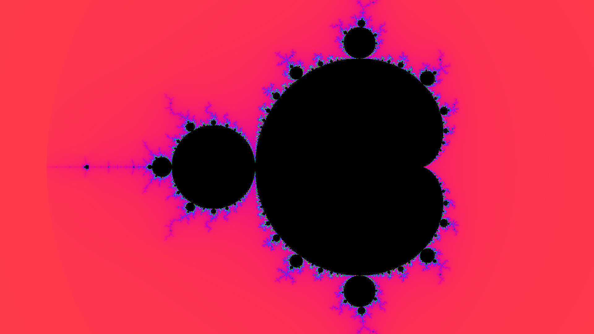

# fractalPy

[](LICENSE)

A small, dependency-light Mandelbrot set renderer accelerated with [Numba](https://numba.pydata.org/).



## Setup

```
python3 -m venv fractal-env
./fractal-env/bin/pip install -r requirements.txt
```

## Usage

Render a single full-set view to `mandelbrot.png`:

```
./fractal-env/bin/python mandelbrot_numba.py
```

All parameters are exposed as CLI args (`--width`, `--height`, `--max-iter`, `--center-x`, `--center-y`, `--zoom`, `--output`), e.g.:

```
./fractal-env/bin/python mandelbrot_numba.py --center-x -0.743643887037151 --center-y 0.13182590420533 --zoom 1e-8 --max-iter 2000
```

Benchmark render time across a grid of zoom levels and iteration counts:

```
./fractal-env/bin/python benchmark.py
```

Override the defaults with `--width`, `--height`, `--center-x`, `--center-y`, `--zoom-levels`, and `--iter-levels` (the latter two take comma-separated values).

Render PNGs at a sequence of deep zoom levels to visually check for float64 precision breakdown:

```
./fractal-env/bin/python precision_check.py
```

Takes the same `--width`, `--height`, `--max-iter`, `--center-x`, `--center-y`, and `--zoom-levels` (comma-separated) args.

## Linting

```
./fractal-env/bin/pip install -r requirements-dev.txt
./fractal-env/bin/ruff check .
```

## Notes

- The Mandelbrot kernel is JIT-compiled with `@njit(parallel=True, fastmath=True, cache=True)`; compiled code is cached under `__pycache__/`.
- Double-precision (float64) arithmetic limits how deep you can zoom before artifacting appears — see the output of `precision_check.py`.

## On the blog

* https://blog.0x32.co.uk/posts/fractalpy/
